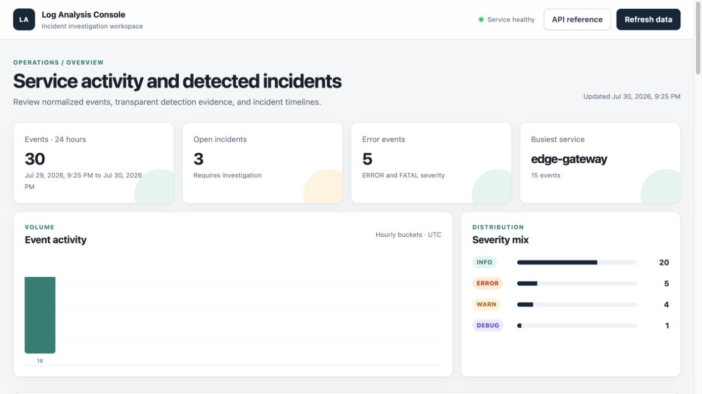
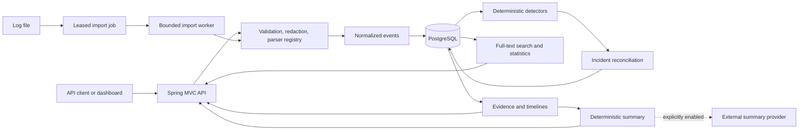
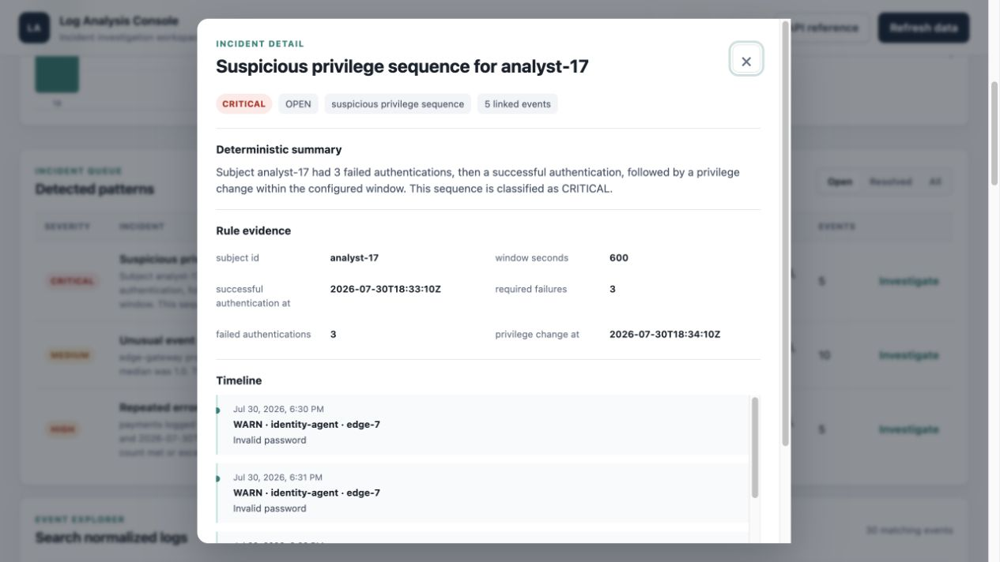
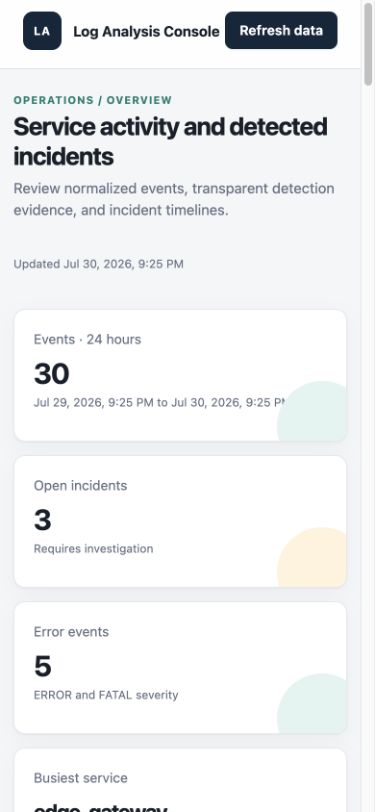

# Intelligent Log Analyzer

Intelligent Log Analyzer is a Java service that turns mixed application and device logs into a
consistent event stream, searchable evidence, and explainable incident timelines. Detection starts
with transparent rules, so every severity and summary can be traced to stored events and
thresholds.



## Problem

Operational logs often use different timestamps, severity names, identifiers, and message
structures. Searching each source separately makes it difficult to recognize a repeated failure,
an unusual traffic burst, or an authentication sequence. This project normalizes those formats and
connects related events without hiding the detection logic.

## Features

- Bounded REST ingestion and recoverable asynchronous file imports
- Parsers for JSON Lines, RFC 5424 syslog, application logs, and combined access logs
- Credential redaction, canonical message fingerprints, and duplicate external-ID checks
- Repeated-error, event-spike, and suspicious privilege-sequence rules
- Stored thresholds, observations, grouping keys, and linked event timelines
- Filters by time, source, service, severity, and PostgreSQL full text
- Aggregated statistics and a responsive investigation dashboard
- Deterministic incident summaries by default
- Optional chat-compatible HTTP summary provider, disabled by default
- Flyway migrations, readiness/liveness probes, request IDs, structured logs, and Prometheus metrics
- Unit, PostgreSQL integration, API, and labelled evaluation tests

The [requirements](docs/requirements.md) and [design decisions](docs/design-decisions.md) define the
intended scope.

## Architecture



The service is a modular monolith. PostgreSQL is authoritative for import jobs, normalized events,
incidents, and timeline links. File jobs use database leases rather than an additional message
broker, which keeps the local system recoverable without adding infrastructure.

## Run locally

Prerequisites:

- Docker with Compose
- `curl`
- Java 21 only if running outside Docker

Copy the example configuration and replace the local password:

```bash
cp .env.example .env
docker compose up --detach --build --wait
./scripts/smoke-test.sh
```

Load the original synthetic feeds:

```bash
./scripts/load-demo-data.sh
```

Open:

- Dashboard: <http://127.0.0.1:8080/>
- API reference: <http://127.0.0.1:8080/swagger-ui.html>
- Readiness: <http://127.0.0.1:8080/actuator/health/readiness>
- Metrics: <http://127.0.0.1:8080/actuator/prometheus>

Stop the stack with `docker compose down`. Add `--volumes` only when the local database and import
data should also be removed.

### Run from source

Start PostgreSQL from Compose, then run the application with Java 21:

```bash
docker compose up --detach postgres
./gradlew bootRun
```

The Gradle wrapper checksum and resolved dependency versions are committed. The application
validates the schema through Flyway and Hibernate on startup.

## Example requests

Submit a bounded batch:

```bash
curl --request POST http://127.0.0.1:8080/api/v1/log-events \
  --header 'Content-Type: application/json' \
  --data '{
    "format": "APPLICATION",
    "entries": [
      {"line": "2026-07-30T18:15:01Z ERROR [payments] [payments-2] Downstream charge failed event_type=payment.failed order_id=8101"}
    ]
  }'
```

Import a file for background processing:

```bash
curl --request POST http://127.0.0.1:8080/api/v1/log-imports \
  --form file=@samples/logs/gateway-access.log \
  --form format=ACCESS \
  --form service=edge-gateway
```

Search normalized events:

```bash
curl 'http://127.0.0.1:8080/api/v1/log-events?service=payments&severity=ERROR&q=charge%20failed'
```

List open incidents and inspect a timeline:

```bash
curl 'http://127.0.0.1:8080/api/v1/incidents?status=OPEN'
curl 'http://127.0.0.1:8080/api/v1/incidents/{incident-id}/timeline'
```

Errors use RFC 9457-style problem details and include the request identifier. More requests and
representative responses are in [the API examples](docs/api-examples.md).

## Evaluation

`make evaluate` ingests all four synthetic formats through the normal application path and matches
detected incidents against three labelled expectations. The reproduced local run accepted 30
events and returned 3 true positives, 0 false positives, and 0 false negatives: precision, recall,
and F1 were each `1.0`.

This is a regression dataset, not a general accuracy or scale benchmark. It proves the included
signals remain detectable and the normal events do not create additional incidents. The method and
known threats to validity are documented in [docs/evaluation.md](docs/evaluation.md).

## Technology and design choices

| Choice | Reason |
| --- | --- |
| Java 21 and Spring Boot | Typed domain modelling, mature HTTP and operational support |
| PostgreSQL | Transactions, job leasing, JSON evidence, full-text search, and aggregations |
| Flyway | Versioned schema changes independent of ORM generation |
| Deterministic rules first | Reproducible incident evidence and defensible severity decisions |
| Database-backed imports | Restart recovery without a broker for the current workload |
| Provider interface | Optional prose generation cannot change incident facts or severity |
| Testcontainers | Tests exercise PostgreSQL types, indexes, queries, and migrations |

Exact dependency purposes and licences are recorded in [docs/dependencies.md](docs/dependencies.md).

## Configuration

Configuration uses environment variables. The main settings are:

| Variable | Default | Purpose |
| --- | --- | --- |
| `ILA_DATABASE_URL` | local PostgreSQL URL | JDBC connection |
| `ILA_IMPORT_STORAGE_PATH` | `./data/imports` | queued file storage |
| `ILA_MAX_IMPORT_LINES` | `100000` | per-file line limit |
| `ILA_IMPORT_BATCH_SIZE` | `500` | worker transaction batch |
| `ILA_REPEATED_ERROR_THRESHOLD` | `5` | matching errors per window |
| `ILA_SPIKE_MINIMUM_COUNT` | `10` | minimum events in a spike bucket |
| `ILA_SUMMARY_PROVIDER` | `disabled` | `disabled` or `chat-http` |
| `ILA_SUMMARY_BASE_URL` | local endpoint | provider base URL |
| `ILA_SUMMARY_API_TOKEN` | empty | optional bearer credential |

Never commit `.env`. Provider output is returned on request but cannot alter stored rule evidence.

## Development checks

```bash
make format
make check
make evaluate
make audit
make secret-scan
docker compose build
make image-scan
```

`make check` includes unit, integration, formatting, Checkstyle, and the labelled evaluation.
Continuous integration repeats these checks and performs a Compose smoke test.

## Screenshots

The images below were captured from the running Compose application after loading the synthetic
feeds.





## Limitations

- Rules use fixed windows and thresholds; they do not learn seasonal baselines.
- File imports are line-oriented and limited to local volume storage.
- The API has no authentication, tenancy, or role-based authorization.
- Full-text search uses the PostgreSQL `simple` dictionary and has no relevance tuning.
- The labelled evaluation is intentionally small and synthetic.
- Incidents are updated by rule window; cross-window correlation is not implemented.

## Future improvements

- Add tenant-aware authentication, authorization, retention, and audit policies.
- Move import objects to object storage and publish work through a durable broker when measured
  ingestion demand requires it.
- Compare deterministic spike rules with a seasonality-aware detector on a larger labelled corpus.
- Add analyst annotations and merge/split workflows while preserving evidence history.
- Add measured load tests before making throughput or scale claims.

See [ROADMAP.md](ROADMAP.md) for the shorter release plan.

## Licence

Apache-2.0. The synthetic logs in `samples/` were written for this repository and are covered by
the same licence.
