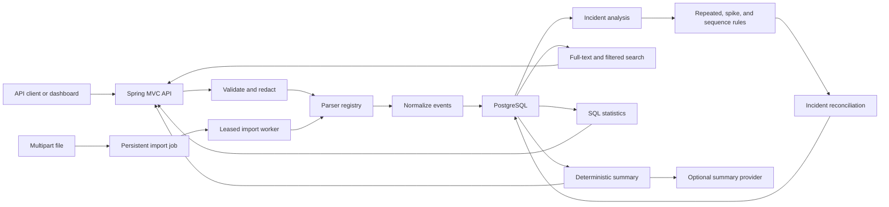
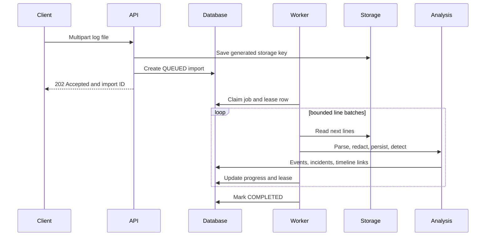

# Architecture

The service is a modular Spring Boot application. PostgreSQL is authoritative for import jobs,
normalized events, incidents, rule evidence, and timelines.

REST batches are intentionally bounded and synchronous. File imports are asynchronous: a
database-backed worker claims jobs using a lease, streams lines in batches, and records accepted
and rejected counts. This avoids adding queue infrastructure while retaining recoverable work.

Detectors return immutable candidates containing a rule code, grouping key, event identifiers,
observed values, and thresholds. Incident reconciliation persists that evidence and links the
timeline events. Provider-assisted text cannot change rule evidence or severity.

## Import sequence

Detection windows are half-open for repeated errors and spikes. This prevents an event on an exact
boundary from contributing to two windows. Sequence detection includes the privilege-change event
at the end of its evidence interval.
